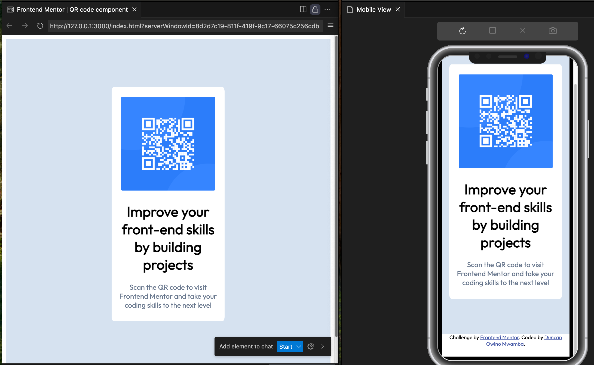

# Frontend Mentor - QR code component solution

This is a solution to the [QR code component challenge on Frontend Mentor](https://www.frontendmentor.io/challenges/qr-code-component-iux_sIO_H). Frontend Mentor challenges help you improve your coding skills by building realistic projects. 

## Table of contents

- [Overview](#overview)
  - [Screenshot](#screenshot)
  - [Links](#links)
- [My process](#my-process)
  - [Built with](#built-with)
  - [What I learned](#what-i-learned)
  - [Continued development](#continued-development)
  - [Useful resources](#useful-resources)
- [Author](#author)
- [Acknowledgments](#acknowledgments)


## Overview

### Screenshot




### Links

- Solution URL: [Solution URL](https://github.com/mwambao/qr-code-component)
- Live Site URL: [Live Site URL](https://qr-code-component-owino.vercel.app/)

## My process

### Built with

- Semantic HTML5 markup
- CSS custom properties
- CSS Grid
- Desktop-first workflow then later Mobile


### What I learned

This project enhanced my understanding on the use of grid to lay content on a web page as I managed to place the below html elements in one grid container of 1 row and 1 column. The grid contains 1 grid-template-area named ==image-qr-code== .

Below is my code snippet:

```html
  <div class="container">
    <div class="image-qr-code">
      

      <p class="main-statement">
      Improve your front-end skills by building projects
      </p>

      <p class="instruction">
      Scan the QR code to visit Frontend Mentor and take your coding skills to the next level
    </p>

    </div>
```
```css
   .container {
        display: grid;
        min-width: fit-content;
        min-height: 100vh;
        grid-template-rows: auto;
        grid-template-columns: auto;
        grid-template-areas: 'image-qr-code';
        gap: 0px;
        justify-content: center;
        align-items: center;
        background-color: var(--Slate-300);


    }
    .image-qr-code {
        grid-area: image-qr-code;
        background-color: var(--White);
        width: 340px;
        text-align: center;
        border: 1px;
        border-radius: 2%;
    }

    .main-statement {
        font-weight: 700;
    }

    .instruction {
        color: var(--Slate-500);
    }

    .image-qr-code img {
        border-radius: 2%;
        margin-top: 20px;
    }
```

### Continued development
Perfect on laying out content on a page using Grid. Also enhance Media Query skills.


### Useful resources

- [CSS Tutorial](https://www.w3schools.com/css/default.asp) - My place to go if i need to quickly check on something!
- [MDN for HTML and CSS](https://developer.mozilla.org/en-US/) - One of the primary resources.


## Author

- Website - [Duncan Owino Mwamba](https://mwambao.github.io/)
- Frontend Mentor - [@mwambao](https://www.frontendmentor.io/profile/mwambao)
- Twitter - [@mwambad](https://x.com/mwambad)


## Acknowledgments

